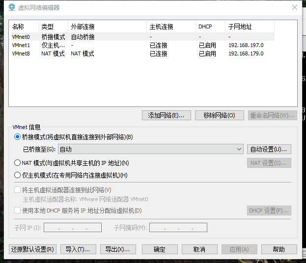

# 

> **BIOS 还是 UEFI**
>
> 经过测试，FreeBSD 也可以支持驱动 UEFI 下 VMware 的显卡。——2023.1.13
>
> 默认情况下 VMware 是 BIOS，会提示没有：
>
> ```shell-session
> # efibootmgr # 默认自带、无需安装。
> efibootmgr: efi variables not supported on this system. root? kldload efirt?
> ```
>
> 如果当前系统是 UEFI,efibootmgr 则输出：
>
> ```shell-session
> # efibootmgr # 默认自带、无需安装。
> Boot to FW : false
> BootCurrent: 0004
> BootOrder  : 0004, 0000, 0001, 0002, 0003
> +Boot0004* FreeBSD
> Boot0000* EFI VMware Virtual SCSI Hard Drive (0.0)
> Boot0001* EFI VMware Virtual IDE CDROM Drive (IDE 1:0)
> Boot0002* EFI Network
> Boot0003* EFI Internal Shell (Unsupported option)
> ```

> **警告**
>
> **注意：由于 [Bug 250580 - VMware UEFI guests crash in virtual hardware after r366691](https://bugs.freebsd.org/bugzilla/show_bug.cgi?id=250580)，FreeBSD 11/12 可能在 VMare 的 UEFI 环境下无法启动。经测试 13.0 正常启动。**

## 视频教程

(FreeBSD 13.1 安装 KDE5——基于 VMware 17)[https://www.bilibili.com/video/BV1UR4y1U71T/)

视频教程环境 VMware 17 + FreeBSD 13.1-RELEASE + BIOS +KDE 5。

## 镜像下载

> **警告**
>
> iso 镜像不适用于物理机，物理机请使用 img 镜像。

>**提示**
>
>虚拟机不推荐使用 FreeBSD 官方构建的[虚拟机镜像](https://download.freebsd.org/releases/VM-IMAGES/13.2-RELEASE/amd64/Latest/)，因为需要手动扩容，而且文件系统不能自由选择，默认是 UFS。
>
>虚拟机一般使用 `FreeBSD-13.2-RELEASE-amd64-disc1.iso` 等类似文件名和后缀的镜像，但是，`FreeBSD-13.2-RELEASE-amd64-memstick.img` 也并非只能用于 U 盘刻录，虚拟机也是可以用的，使用方法参考第 31.2 节。

RELEASE 正式版 镜像下载地址：[https://download.freebsd.org/ftp/releases/amd64/amd64/ISO-IMAGES/13.1/FreeBSD-13.1-RELEASE-amd64-disc1.iso](https://download.freebsd.org/ftp/releases/amd64/amd64/ISO-IMAGES/13.0/FreeBSD-13.0-RELEASE-amd64-disc1.iso)

CURRENT 测试版（仅限专业用户，对于该版本来说，无法启动，环境变量错误都是正常的事情！） 镜像下载地址: [https://download.freebsd.org/snapshots/amd64/amd64/ISO-IMAGES/14.0/](https://download.freebsd.org/snapshots/amd64/amd64/ISO-IMAGES/14.0/)

FreeBSD 旧版本下载地址: [http://ftp-archive.freebsd.org/pub/FreeBSD-Archive/old-releases/amd64/ISO-IMAGES/](http://ftp-archive.freebsd.org/pub/FreeBSD-Archive/old-releases/amd64/ISO-IMAGES/)


## 虚拟机下载

### VMware Workstation Pro

VMware Workstation Pro 是免费试用下载的，请勿从第三方站点下载，否则会造成一些苦难哲学的后果。点击 Download NOW 即可。左边是 Windows 系统使用，右侧是 Linux 系统使用。该软件虽是收费的，但是授权码并不难获得。

[https://www.vmware.com/products/workstation-pro/workstation-pro-evaluation.html](https://www.vmware.com/products/workstation-pro/workstation-pro-evaluation.html)

### VMware Workstation Player

VMware Workstation Player 是个人免费使用的，你也可以选择此版本。

[https://www.vmware.com/products/workstation-player/workstation-player-evaluation.html](https://www.vmware.com/products/workstation-player/workstation-player-evaluation.html)

## 网络设置

请使用 NAT 模式，如果不能与宿主机（物理机）互通，请打开 VMware 编辑-虚拟网络管理器，“还原默认设置”，直至出现类似下图的配置：




以上请不要手动设置，如果虚拟机内部一直提示 `no link`，请重启物理机，再打开虚拟机：VMware 编辑-虚拟网络管理器，“还原默认设置”，直至出现上述配置。（请不要尝试手动配置，那是无效的）

如果没有网络请设置 DNS 为`223.5.5.5`。请看本章其余章节。

## 显卡驱动以及虚拟机增强工具

### 显卡驱动

VMware 自动缩放屏幕请安装显卡驱动和虚拟机增强工具，即：

```shell-session
# pkg install xf86-video-vmware open-vm-tools xf86-input-vmmouse
```

安装完毕后无需任何多余配置即可实现屏幕自动缩放。

> 请勿做多余配置，比如去修改创建 `xorg.conf`，这会造成虚拟机卡死等问题。

> wayland 下也需要安装该驱动。即使 wayland 暂不可用。

> 如果屏幕显示不正常（过大），请尝试：编辑虚拟机设置——>硬件、设备——>显示器——>监视器、指定监视器设置——>任意监视器的最大分辨率，设置为主机的分辨率或者略低于主机分辨率均可。

### 虚拟机增强工具

如果有桌面

```shell-session
# pkg install open-vm-tools xf86-input-vmmouse
```

如果没有桌面：

```shell-session
# pkg install open-vm-tools-nox11
```

具体配置

编辑 `/boot/loader.conf`

写入

```shell-session
fusefs_load="YES"
```

### 共享文件夹

请先安装虚拟机增强工具。

```shell-session
# vmhgfs-fuse .host:/selfsharefold /mnt/hgfs
```

查看共享文件夹

```shell-session
# ls /mnt/hgfs
```

> **提示**
>
> 在使用 Windows 远程桌面或者其他 XRDP 工具远程另一台 Windows 桌面，并使用其上面运行的 Vmware 虚拟机操作 FreeBSD 时，鼠标通常会变得难以控制。

